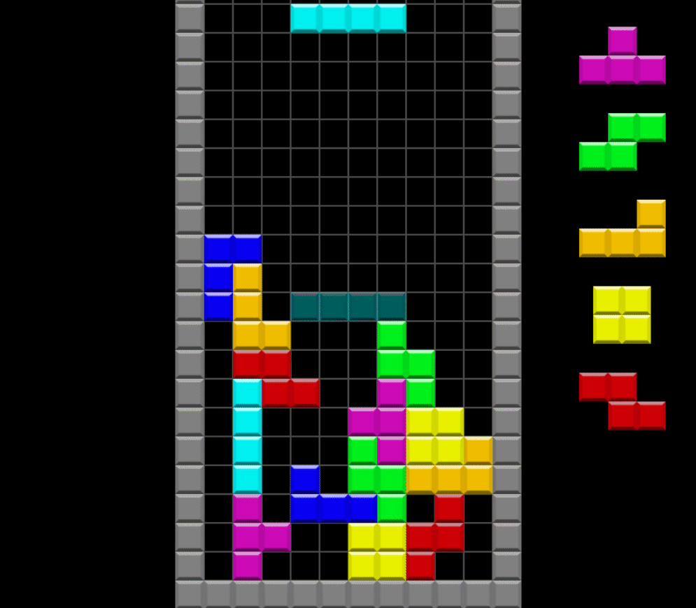

*Tetris-RL*
============================================
Modern Tetris environment for Reinforcement Learning. Supports twists (spin moves, such as t-spin)
and wall kicks. Useful for training an AI to play in tetris vs. mode.
Requires pygame.


How to use as RL environment.
---------------------------------------------
Simply instantiate a new game
```
from tetris.gamemodes.tetris import TetrisMode

env = TetrisMode()
```
and create a game loop
```
run = True
while run:
    actions = env.reset()
    act = random.sample(actions, 1)[0]
    while True:
        state_matrix, line_info, pieces, actions, done = env.step(act)
        env.render()
        if done:
            break
        act = random.sample(actions, 1)[0]
```

Do note that it's not necessary to break the loop and reset the environment to reset the game. It automatically resets when the tetris stack reaches the top.

- env.reset() returns a list of actions, which are (Line, Column, Rotation) tuples indicating where to place the current piece, with the exception of the tuple (0, 0, 4),
which indicates the hold move.

- env.step() returns all the information related to the execution of the previous action, and the information related to the new game state
    - state_matrix: 20x10 matrix of zeros and ones representing the tetris board;
    - line_info: list containing cleared lines (int), back to back (bool), tspin (bool), perfect clear (bool), combo (int);
    - pieces: list with information about the current piece, the next pieces and the hold piece;
    - actions: list of valid actions for next step.
    
- env.render() renders the game (optional)

The list of actions returned is a list contaning all possible places to put the current tetromino. This is done to make it faster to simulate the environment.
It's up to the user to build the key sequence to place the piece on the chosen position, although it's possible
to tweak the code and access the key sequence which is a biproduct of finding all possible locations to place the piece.

As you can see, the environment follows basically all the gym environment rules, but it's not integrated with gym.

How to use as a tetris game
---------------------------------------------
Simply run the render function in a game loop:
```
run = True
while run:
    env.render()
```
Use WASD to move, KL to rotate and LSHIFT to hold